# InterviewQuiz 技术架构文档

## 1. 系统概述

### 1.1 项目背景
InterviewQuiz 是一款面向计算机/AI岗位面试的刷题应用，采用 Kotlin 2.0 + Jetpack Compose 构建，遵循 Clean Architecture 架构模式。

### 1.2 技术栈
| 层级 | 技术 |
|------|------|
| 框架 | Android SDK 34 |
| UI | Jetpack Compose + Material Design 3 |
| 架构 | MVVM + Clean Architecture |
| 依赖注入 | Hilt 2.50 |
| 状态管理 | StateFlow |
| 编译 | Kotlin KSP |
| 构建 | Gradle 8.2 |
| CI/CD | GitHub Actions |

---

## 2. 整体架构图

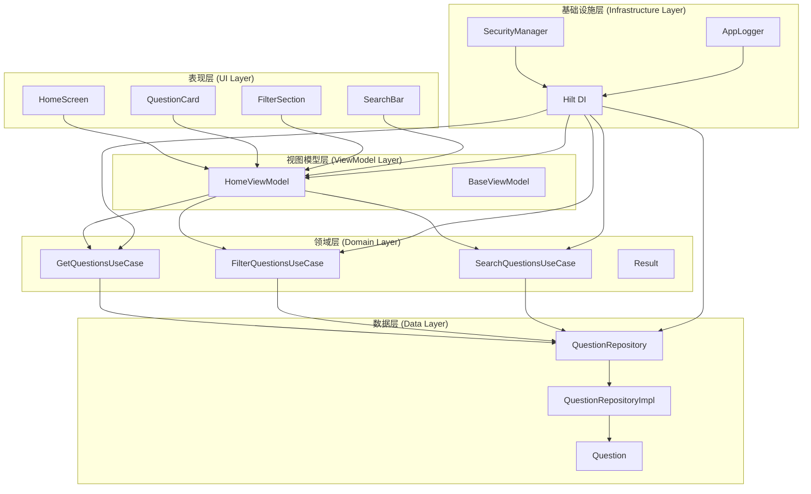
```mermaid
graph TB
    subgraph "表现层 (UI Layer)"
        A[HomeScreen]
        B[QuestionCard]
        C[FilterSection]
        D[SearchBar]
    end
    
    subgraph "视图模型层 (ViewModel Layer)"
        E[HomeViewModel]
        F[BaseViewModel]
    end
    
    subgraph "领域层 (Domain Layer)"
        G[GetQuestionsUseCase]
        H[FilterQuestionsUseCase]
        I[SearchQuestionsUseCase]
        J[Result]
    end
    
    subgraph "数据层 (Data Layer)"
        K[QuestionRepository]
        L[QuestionRepositoryImpl]
        M[Question]
    end
    
    subgraph "基础设施层 (Infrastructure Layer)"
        N[Hilt DI]
        O[SecurityManager]
        P[AppLogger]
    end
    
    A --> E
    B --> E
    C --> E
    D --> E
    E --> G
    E --> H
    E --> I
    G --> K
    H --> K
    I --> K
    K --> L
    L --> M
    N --> G
    N --> H
    N --> I
    N --> K
    N --> E
    O --> N
    P --> N
```

---

## 3. 架构分层详解

### 3.1 表现层 (UI Layer)
负责用户界面展示和用户交互处理。

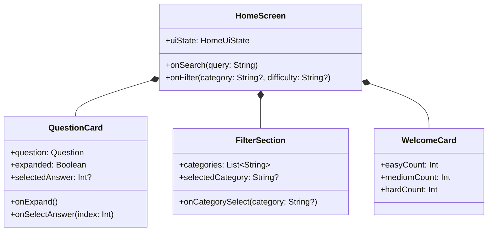
```mermaid
classDiagram
    class HomeScreen {
        +uiState: HomeUiState
        +onSearch(query: String)
        +onFilter(category: String?, difficulty: String?)
    }
    
    class QuestionCard {
        +question: Question
        +expanded: Boolean
        +selectedAnswer: Int?
        +onExpand()
        +onSelectAnswer(index: Int)
    }
    
    class FilterSection {
        +categories: List~String~
        +selectedCategory: String?
        +onCategorySelect(category: String?)
    }
    
    class WelcomeCard {
        +easyCount: Int
        +mediumCount: Int
        +hardCount: Int
    }
    
    HomeScreen *-- QuestionCard
    HomeScreen *-- FilterSection
    HomeScreen *-- WelcomeCard
```

### 3.2 视图模型层 (ViewModel Layer)
管理 UI 状态和处理业务逻辑。

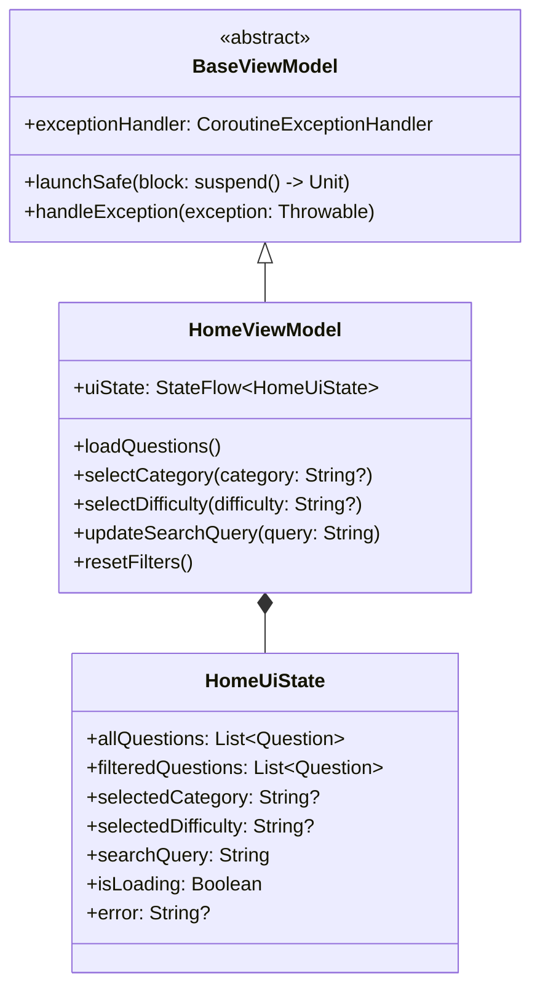
```mermaid
classDiagram
    class BaseViewModel {
        <<abstract>>
        +exceptionHandler: CoroutineExceptionHandler
        +launchSafe(block: suspend () -> Unit)
        +handleException(exception: Throwable)
    }
    
    class HomeViewModel {
        +uiState: StateFlow~HomeUiState~
        +loadQuestions()
        +selectCategory(category: String?)
        +selectDifficulty(difficulty: String?)
        +updateSearchQuery(query: String)
        +resetFilters()
    }
    
    class HomeUiState {
        +allQuestions: List~Question~
        +filteredQuestions: List~Question~
        +selectedCategory: String?
        +selectedDifficulty: String?
        +searchQuery: String
        +isLoading: Boolean
        +error: String?
    }
    
    BaseViewModel <|-- HomeViewModel
    HomeViewModel *-- HomeUiState
```

### 3.3 领域层 (Domain Layer)
封装核心业务逻辑。

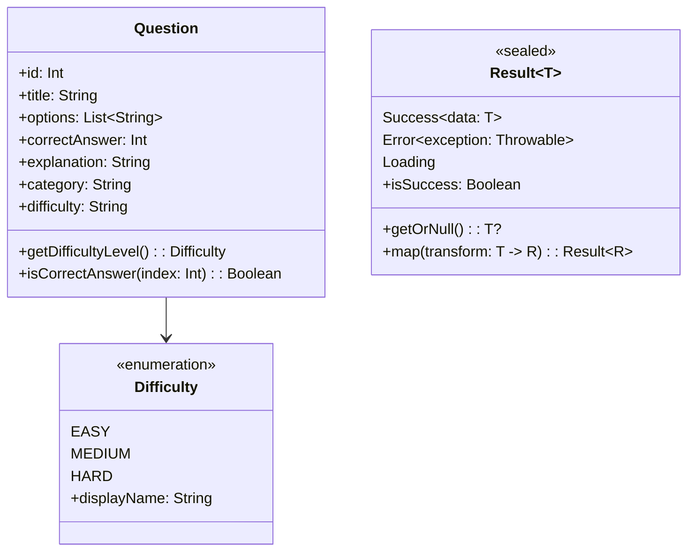
```mermaid
classDiagram
    class Question {
        +id: Int
        +title: String
        +options: List~String~
        +correctAnswer: Int
        +explanation: String
        +category: String
        +difficulty: String
        +getDifficultyLevel(): Difficulty
        +isCorrectAnswer(index: Int): Boolean
    }
    
    class Difficulty {
        <<enumeration>>
        EASY
        MEDIUM
        HARD
        +displayName: String
    }
    
    class Result~T~ {
        <<sealed>>
        Success~data: T~
        Error~exception: Throwable~
        Loading
        +isSuccess: Boolean
        +getOrNull(): T?
        +map(transform: T -> R): Result~R~
    }
    
    Question --> Difficulty
```

### 3.4 数据层 (Data Layer)
处理数据存储和获取。

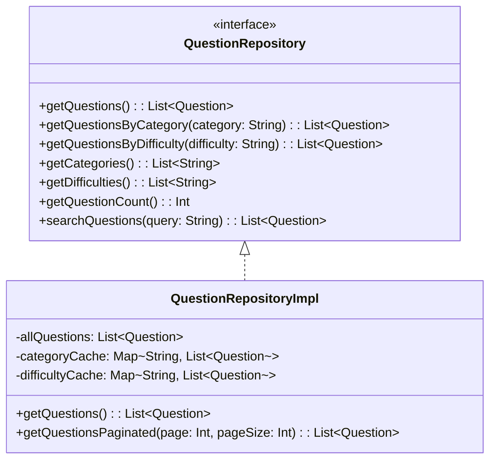
```mermaid
classDiagram
    class QuestionRepository {
        <<interface>>
        +getQuestions(): List~Question~
        +getQuestionsByCategory(category: String): List~Question~
        +getQuestionsByDifficulty(difficulty: String): List~Question~
        +getCategories(): List~String~
        +getDifficulties(): List~String~
        +getQuestionCount(): Int
        +searchQuestions(query: String): List~Question~
    }
    
    class QuestionRepositoryImpl {
        -allQuestions: List~Question~
        -categoryCache: Map~String, List~Question~~
        -difficultyCache: Map~String, List~Question~~
        +getQuestions(): List~Question~
        +getQuestionsPaginated(page: Int, pageSize: Int): List~Question~
    }
    
    QuestionRepository <|.. QuestionRepositoryImpl
```

---

## 4. 数据流图

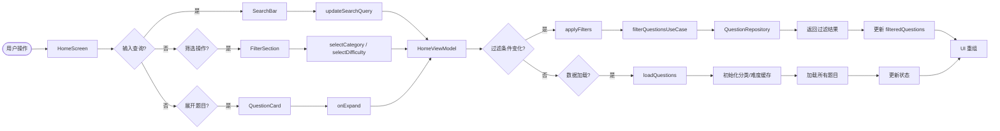
```mermaid
flowchart LR
    A([用户操作]) --> B[HomeScreen]
    B --> C{输入查询?}
    C -->|是| D[SearchBar]
    D --> E[updateSearchQuery]
    E --> F[HomeViewModel]
    C -->|否| G{筛选操作?}
    G -->|是| H[FilterSection]
    H --> I[selectCategory / selectDifficulty]
    I --> F
    C -->|否| J{展开题目?}
    J -->|是| K[QuestionCard]
    K --> L[onExpand]
    L --> F
    
    F --> M{过滤条件变化?}
    M -->|是| N[applyFilters]
    N --> O[filterQuestionsUseCase]
    O --> P[QuestionRepository]
    P --> Q[返回过滤结果]
    Q --> R[更新 filteredQuestions]
    R --> S[UI 重组]
    
    M -->|否| T{数据加载?}
    T -->|是| U[loadQuestions]
    U --> V[初始化分类/难度缓存]
    V --> W[加载所有题目]
    W --> X[更新状态]
    X --> S
```

---

## 5. 流程图

### 5.1 应用启动流程

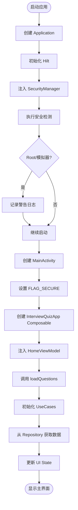
```mermaid
flowchart TD
    A([启动应用]) --> B[创建 Application]
    B --> C[初始化 Hilt]
    C --> D[注入 SecurityManager]
    D --> E[执行安全检测]
    E --> F{Root/模拟器?}
    F -->|是| G[记录警告日志]
    G --> H[继续启动]
    F -->|否| H
    H --> I[创建 MainActivity]
    I --> J[设置 FLAG_SECURE]
    J --> K[创建 InterviewQuizApp Composable]
    K --> L[注入 HomeViewModel]
    L --> M[调用 loadQuestions]
    M --> N[初始化 UseCases]
    N --> O[从 Repository 获取数据]
    O --> P[更新 UI State]
    P --> Q([显示主界面])
```

### 5.2 题目筛选流程

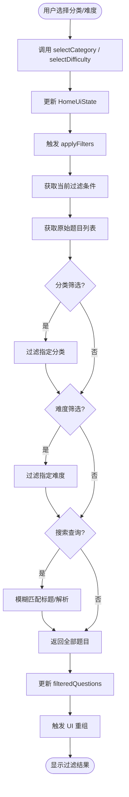
```mermaid
flowchart TD
    A([用户选择分类/难度]) --> B[调用 selectCategory / selectDifficulty]
    B --> C[更新 HomeUiState]
    C --> D[触发 applyFilters]
    D --> E[获取当前过滤条件]
    E --> F[获取原始题目列表]
    F --> G{分类筛选?}
    G -->|是| H[过滤指定分类]
    H --> I
    G -->|否| I{难度筛选?}
    I -->|是| J[过滤指定难度]
    J --> K
    I -->|否| K{搜索查询?}
    K -->|是| L[模糊匹配标题/解析]
    L --> M[返回过滤结果]
    K -->|否| M[返回全部题目]
    M --> N[更新 filteredQuestions]
    N --> O[触发 UI 重组]
    O --> P([显示过滤结果])
```

### 5.3 题目作答流程

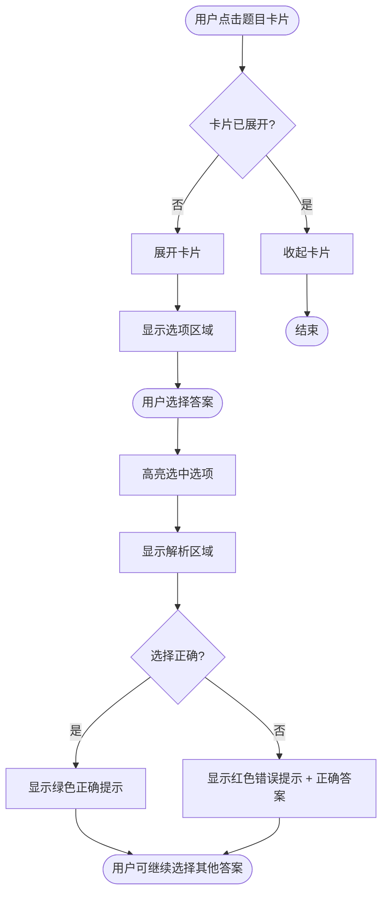
```mermaid
flowchart TD
    A([用户点击题目卡片]) --> B{卡片已展开?}
    B -->|否| C[展开卡片]
    B -->|是| D[收起卡片]
    C --> E[显示选项区域]
    D --> Z([结束])
    E --> F([用户选择答案])
    F --> G[高亮选中选项]
    G --> H[显示解析区域]
    H --> I{选择正确?}
    I -->|是| J[显示绿色正确提示]
    I -->|否| K[显示红色错误提示 + 正确答案]
    J --> L([用户可继续选择其他答案])
    K --> L
```

---

## 6. 时序图

### 6.1 应用启动时序

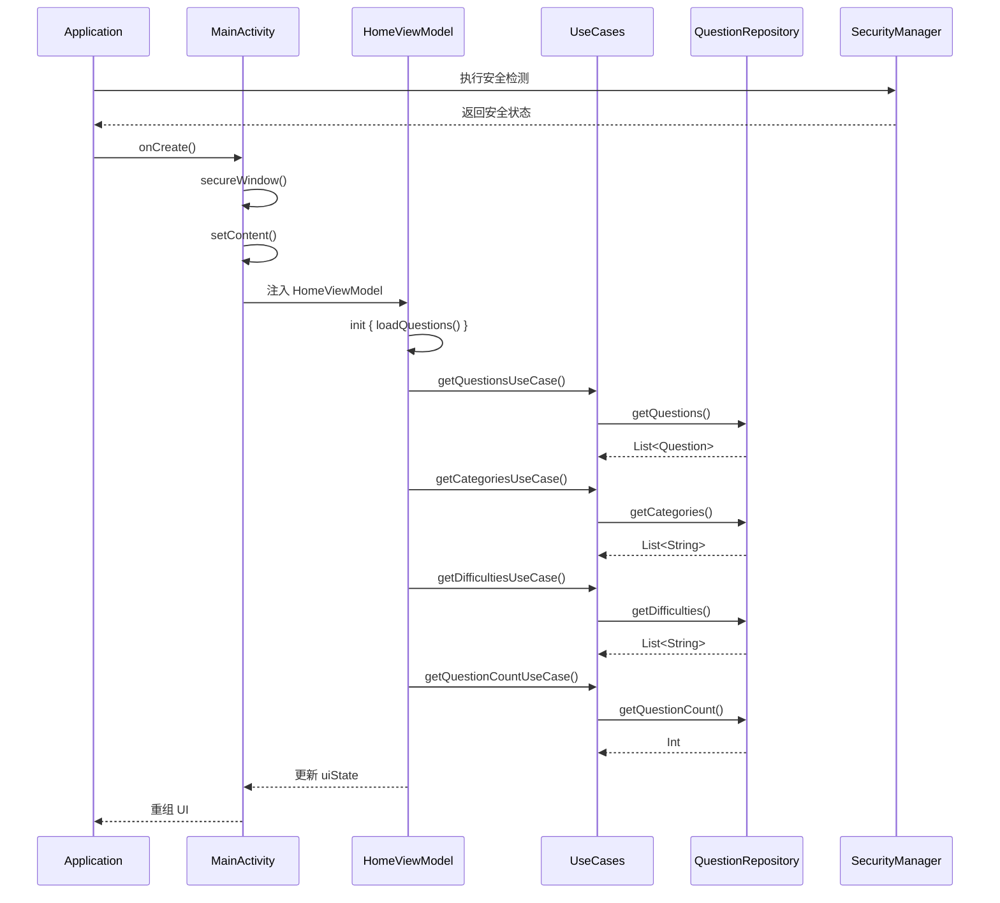
```mermaid
sequenceDiagram
    participant App as Application
    participant Main as MainActivity
    participant VM as HomeViewModel
    participant UC as UseCases
    participant Repo as QuestionRepository
    participant Sec as SecurityManager
    
    App->>Sec: 执行安全检测
    Sec-->>App: 返回安全状态
    
    App->>Main: onCreate()
    Main->>Main: secureWindow()
    Main->>Main: setContent()
    
    Main->>VM: 注入 HomeViewModel
    VM->>VM: init { loadQuestions() }
    
    VM->>UC: getQuestionsUseCase()
    UC->>Repo: getQuestions()
    Repo-->>UC: List<Question>
    
    VM->>UC: getCategoriesUseCase()
    UC->>Repo: getCategories()
    Repo-->>UC: List<String>
    
    VM->>UC: getDifficultiesUseCase()
    UC->>Repo: getDifficulties()
    Repo-->>UC: List<String>
    
    VM->>UC: getQuestionCountUseCase()
    UC->>Repo: getQuestionCount()
    Repo-->>UC: Int
    
    VM-->>Main: 更新 uiState
    Main-->>App: 重组 UI
```

### 6.2 题目筛选时序

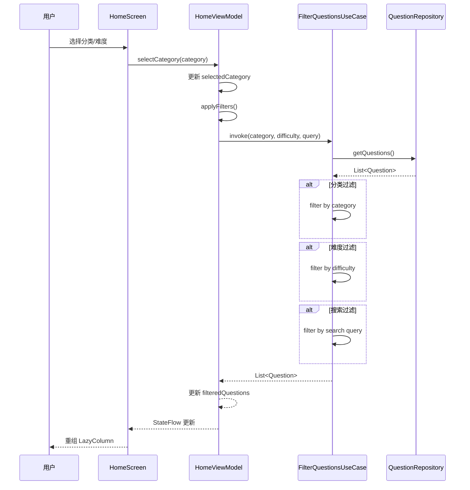
```mermaid
sequenceDiagram
    participant User as 用户
    participant UI as HomeScreen
    participant VM as HomeViewModel
    participant UC as FilterQuestionsUseCase
    participant Repo as QuestionRepository
    
    User->>UI: 选择分类/难度
    UI->>VM: selectCategory(category)
    
    VM->>VM: 更新 selectedCategory
    VM->>VM: applyFilters()
    
    VM->>UC: invoke(category, difficulty, query)
    
    UC->>Repo: getQuestions()
    Repo-->>UC: List<Question>
    
    alt 分类过滤
        UC->>UC: filter by category
    end
    
    alt 难度过滤
        UC->>UC: filter by difficulty
    end
    
    alt 搜索过滤
        UC->>UC: filter by search query
    end
    
    UC-->>VM: List<Question>
    VM-->>VM: 更新 filteredQuestions
    VM-->>UI: StateFlow 更新
    UI-->>User: 重组 LazyColumn
```

### 6.3 数据缓存时序

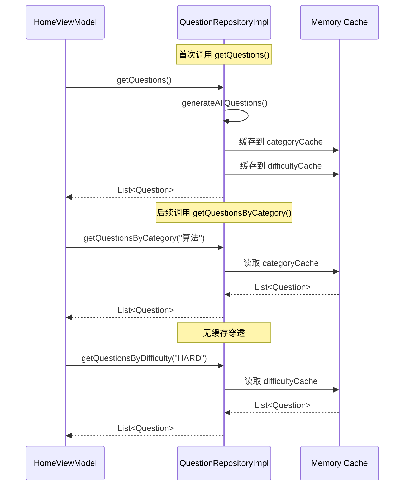
```mermaid
sequenceDiagram
    participant VM as HomeViewModel
    participant Repo as QuestionRepositoryImpl
    participant Cache as Memory Cache
    
    Note over Repo: 首次调用 getQuestions()
    VM->>Repo: getQuestions()
    Repo->>Repo: generateAllQuestions()
    Repo->>Cache: 缓存到 categoryCache
    Repo->>Cache: 缓存到 difficultyCache
    Repo-->>VM: List<Question>
    
    Note over Repo: 后续调用 getQuestionsByCategory()
    VM->>Repo: getQuestionsByCategory("算法")
    Repo->>Cache: 读取 categoryCache
    Cache-->>Repo: List<Question>
    Repo-->>VM: List<Question>
    
    Note over Repo: 无缓存穿透
    VM->>Repo: getQuestionsByDifficulty("HARD")
    Repo->>Cache: 读取 difficultyCache
    Cache-->>Repo: List<Question>
    Repo-->>VM: List<Question>
```

---

## 7. 模块依赖图

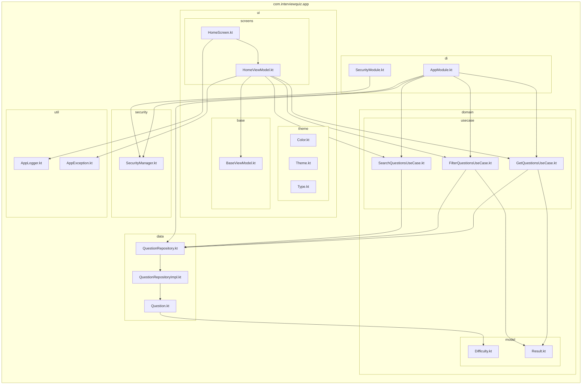
```mermaid
graph LR
    subgraph "com.interviewquiz.app"
        subgraph "ui"
            subgraph "screens"
                A[HomeScreen.kt]
                B[HomeViewModel.kt]
            end
            subgraph "theme"
                C[Color.kt]
                D[Theme.kt]
                E[Type.kt]
            end
            subgraph "base"
                F[BaseViewModel.kt]
            end
        end
        
        subgraph "data"
            G[Question.kt]
            H[QuestionRepository.kt]
            I[QuestionRepositoryImpl.kt]
        end
        
        subgraph "domain"
            subgraph "model"
                J[Result.kt]
                K[Difficulty.kt]
            end
            subgraph "usecase"
                L[GetQuestionsUseCase.kt]
                M[FilterQuestionsUseCase.kt]
                N[SearchQuestionsUseCase.kt]
            end
        end
        
        subgraph "di"
            O[AppModule.kt]
            P[SecurityModule.kt]
        end
        
        subgraph "security"
            Q[SecurityManager.kt]
        end
        
        subgraph "util"
            R[AppLogger.kt]
            S[AppException.kt]
        end
    end
    
    A --> B
    B --> L
    B --> M
    B --> N
    L --> H
    M --> H
    N --> H
    H --> I
    I --> G
    G --> K
    L --> J
    M --> J
    B --> F
    O --> L
    O --> M
    O --> N
    O --> H
    O --> Q
    P --> Q
    A --> R
    B --> S
```

---

## 8. 包结构图

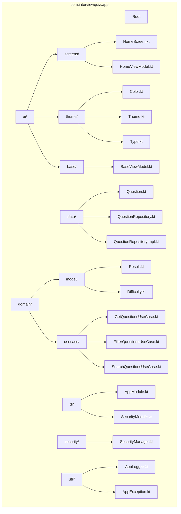
```mermaid
graph TD
    subgraph "com.interviewquiz.app"
        A[Root]
        B[ui/]
        C[data/]
        D[domain/]
        E[di/]
        F[security/]
        G[util/]
        
        B --> B1[screens/]
        B --> B2[theme/]
        B --> B3[base/]
        
        B1 --> B11[HomeScreen.kt]
        B1 --> B12[HomeViewModel.kt]
        
        B2 --> B21[Color.kt]
        B2 --> B22[Theme.kt]
        B2 --> B23[Type.kt]
        
        B3 --> B31[BaseViewModel.kt]
        
        C --> C1[Question.kt]
        C --> C2[QuestionRepository.kt]
        C --> C3[QuestionRepositoryImpl.kt]
        
        D --> D1[model/]
        D --> D2[usecase/]
        
        D1 --> D11[Result.kt]
        D1 --> D12[Difficulty.kt]
        
        D2 --> D21[GetQuestionsUseCase.kt]
        D2 --> D22[FilterQuestionsUseCase.kt]
        D2 --> D23[SearchQuestionsUseCase.kt]
        
        E --> E1[AppModule.kt]
        E --> E2[SecurityModule.kt]
        
        F --> F1[SecurityManager.kt]
        
        G --> G1[AppLogger.kt]
        G --> G2[AppException.kt]
    end
```

---

## 9. 状态机图

### 9.1 题目卡片状态

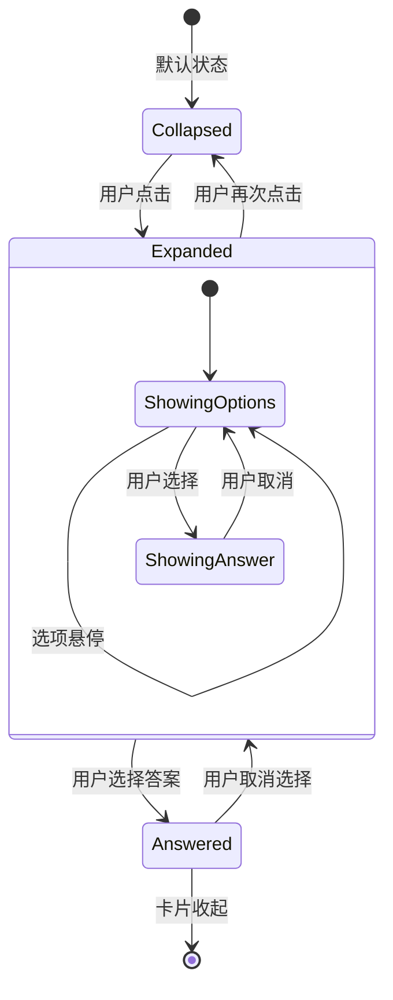
```mermaid
stateDiagram-v2
    [*] --> Collapsed: 默认状态
    Collapsed --> Expanded: 用户点击
    Expanded --> Collapsed: 用户再次点击
    Expanded --> Answered: 用户选择答案
    Answered --> Expanded: 用户取消选择
    Answered --> [*]: 卡片收起
    
    state Expanded {
        [*] --> ShowingOptions
        ShowingOptions --> ShowingOptions: 选项悬停
        ShowingOptions --> ShowingAnswer: 用户选择
        ShowingAnswer --> ShowingOptions: 用户取消
    }
```

### 9.2 筛选状态

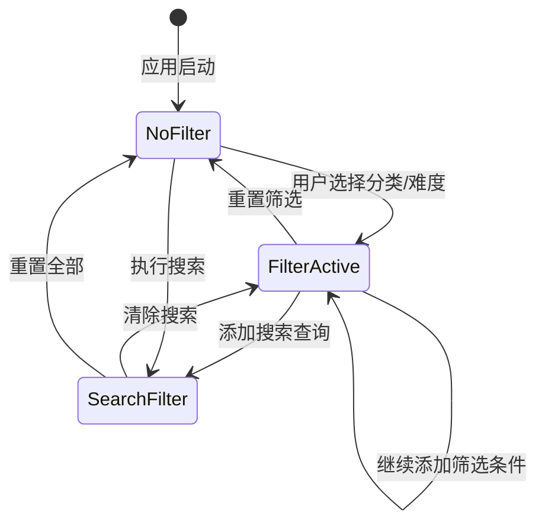
```mermaid
stateDiagram-v2
    [*] --> NoFilter: 应用启动
    NoFilter --> FilterActive: 用户选择分类/难度
    FilterActive --> FilterActive: 继续添加筛选条件
    FilterActive --> NoFilter: 重置筛选
    FilterActive --> SearchFilter: 添加搜索查询
    SearchFilter --> FilterActive: 清除搜索
    SearchFilter --> NoFilter: 重置全部
    NoFilter --> SearchFilter: 执行搜索
```

---

## 10. 部署架构图

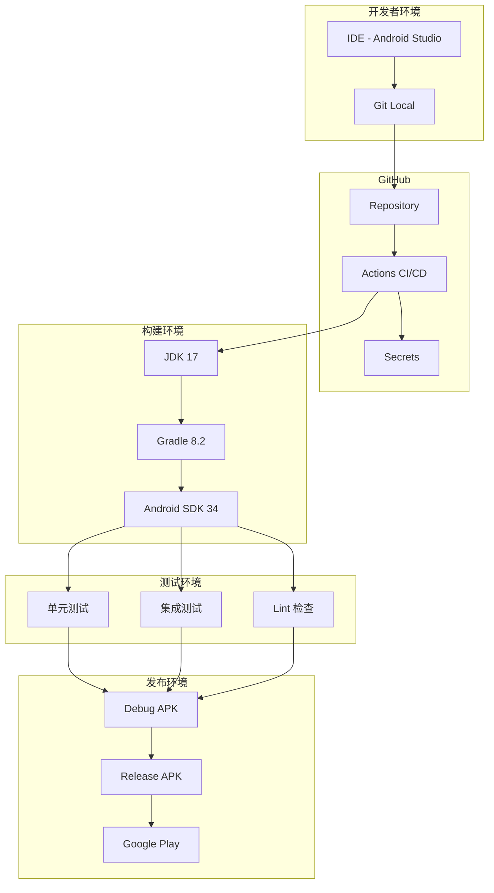
```mermaid
graph TB
    subgraph "开发者环境"
        A1[IDE - Android Studio]
        A2[Git Local]
    end
    
    subgraph "GitHub"
        B1[Repository]
        B2[Actions CI/CD]
        B3[Secrets]
    end
    
    subgraph "构建环境"
        C1[JDK 17]
        C2[Gradle 8.2]
        C3[Android SDK 34]
    end
    
    subgraph "测试环境"
        D1[单元测试]
        D2[集成测试]
        D3[Lint 检查]
    end
    
    subgraph "发布环境"
        E1[Debug APK]
        E2[Release APK]
        E3[Google Play]
    end
    
    A1 --> A2
    A2 --> B1
    B1 --> B2
    B2 --> C1
    C1 --> C2
    C2 --> C3
    C3 --> D1
    C3 --> D2
    C3 --> D3
    D1 --> E1
    D2 --> E1
    D3 --> E1
    E1 --> E2
    E2 --> E3
    B2 --> B3
```

---

## 11. 安全架构图

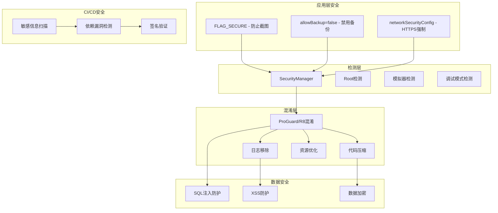
```mermaid
flowchart TB
    subgraph "应用层安全"
        A1[FLAG_SECURE - 防止截图]
        A2[allowBackup=false - 禁用备份]
        A3[networkSecurityConfig - HTTPS强制]
    end
    
    subgraph "检测层"
        B1[SecurityManager]
        B2[Root检测]
        B3[模拟器检测]
        B4[调试模式检测]
    end
    
    subgraph "混淆层"
        C1[ProGuard/R8混淆]
        C2[日志移除]
        C3[代码压缩]
        C4[资源优化]
    end
    
    subgraph "数据安全"
        D1[SQL注入防护]
        D2[XSS防护]
        D3[数据加密]
    end
    
    subgraph "CI/CD安全"
        E1[敏感信息扫描]
        E2[依赖漏洞检测]
        E3[签名验证]
    end
    
    A1 --> B1
    A2 --> B1
    A3 --> B1
    B1 --> C1
    C1 --> C2
    C1 --> C3
    C1 --> C4
    C1 --> D1
    C2 --> D2
    C3 --> D3
    E1 --> E2
    E2 --> E3
```

---

## 12. 性能优化架构

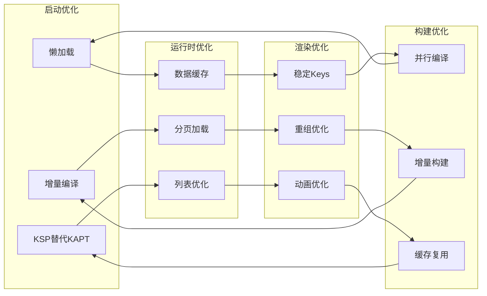
```mermaid
flowchart LR
    subgraph "启动优化"
        A1[懒加载]
        A2[增量编译]
        A3[KSP替代KAPT]
    end
    
    subgraph "运行时优化"
        B1[数据缓存]
        B2[分页加载]
        B3[列表优化]
    end
    
    subgraph "渲染优化"
        C1[稳定Keys]
        C2[重组优化]
        C3[动画优化]
    end
    
    subgraph "构建优化"
        D1[并行编译]
        D2[增量构建]
        D3[缓存复用]
    end
    
    A1 --> B1
    B1 --> C1
    C1 --> D1
    D1 --> A1
    
    A2 --> B2
    B2 --> C2
    C2 --> D2
    D2 --> A2
    
    A3 --> B3
    B3 --> C3
    C3 --> D3
    D3 --> A3
```

---

## 13. 错误处理架构

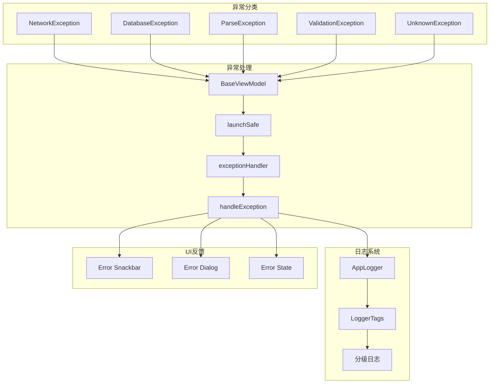
```mermaid
flowchart TD
    subgraph "异常分类"
        A1[NetworkException]
        A2[DatabaseException]
        A3[ParseException]
        A4[ValidationException]
        A5[UnknownException]
    end
    
    subgraph "异常处理"
        B1[BaseViewModel]
        B2[launchSafe]
        B3[exceptionHandler]
        B4[handleException]
    end
    
    subgraph "日志系统"
        C1[AppLogger]
        C2[LoggerTags]
        C3[分级日志]
    end
    
    subgraph "UI反馈"
        D1[Error Snackbar]
        D2[Error Dialog]
        D3[Error State]
    end
    
    A1 --> B1
    A2 --> B1
    A3 --> B1
    A4 --> B1
    A5 --> B1
    
    B1 --> B2
    B2 --> B3
    B3 --> B4
    B4 --> C1
    C1 --> C2
    C2 --> C3
    
    B4 --> D1
    B4 --> D2
    B4 --> D3
```

---

## 14. 依赖关系矩阵

| 模块 | HomeScreen | HomeViewModel | UseCases | Repository | Question |
|------|------------|---------------|----------|------------|----------|
| **HomeScreen** | - | 调用 | - | - | 使用 |
| **HomeViewModel** | 提供状态 | - | 调用 | - | 使用 |
| **UseCases** | - | 提供结果 | - | 调用 | - |
| **Repository** | - | - | 提供数据 | - | 使用 |
| **Security** | - | - | - | 注入 | - |
| **DI Module** | - | 注入 | 注入 | 注入 | - |

---

## 15. 版本历史

| 版本 | 日期 | 修改内容 | 作者 |
|------|------|----------|------|
| v1.0.0 | 2026-05-16 | 初始架构设计 | InterviewQuiz Team |
| v1.1.0 | 2026-05-17 | 11维度深度优化 | InterviewQuiz Team |
